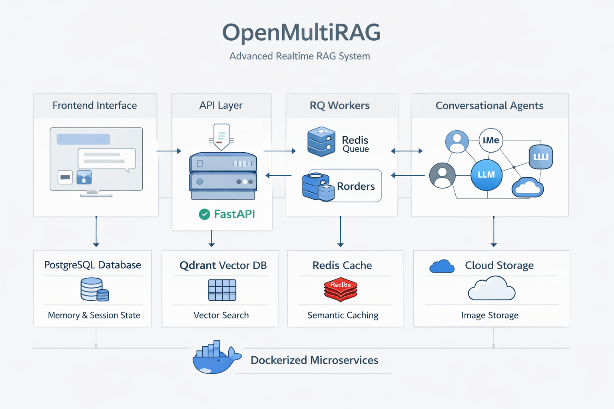

# OpenMultiRAG: Advanced Realtime RAG System

OpenMultiRAG is an industry-grade, realtime Retrieval-Augmented Generation (RAG) system built to handle multiple documents, complex conversational workflows, multimodal parsing (text + images), strict citation tracking, and intelligent caching. The platform is designed using a robust microservices architecture encapsulated in Docker.

## High-Level Architecture Diagram

  

ßß

##  System Architecture

The project consists of several interconnected components running asynchronously to deliver a smooth and resilient user experience:

1. **Frontend Interface (Streamlit)**: 
   Provides a user-friendly conversational UI (`frontend.py`). It enables dynamic document uploads, real-time backend polling for processing status, and a stateful chat interface supporting queries across multiple active documents. It correctly visualizes citations and even embedded images discovered within the source PDFs.

2. **API Layer (FastAPI)**: 
   The central router (`app/main.py`, `app/api/routes.py`) that manages HTTP requests. It accepts document uploads, tracks their state using PostgreSQL, delegates heavy-lifting extraction to background workers, and exposes the LangGraph conversational agent to the frontend.

3. **Background Worker (RQ + Redis)**: 
   To maintain API responsiveness, PDF extraction and vector embeddings are offloaded to an asynchronous task queue. The `worker.py` script listens to a Redis broker. When a document is uploaded, the worker utilizes `PyMuPDF` for concurrent parsing of text and images. It independently calls out to Cloudflare R2 for storage and the Qdrant vector database for indexing, updating the Postgres state exactly when done.

4. **Multi-Agent Conversational Workflow (LangGraph)**: 
   The core intelligence lies in `app/graph/workflow.py` and `app/graph/nodes.py`. The conversational chain is modeled as a state machine:
   - **Query Rewrite**: Uses a fast LLM (`llama-3.1-8b-instant`) to rewrite user queries based on previous conversational context.
   - **Semantic Cache Check**: Checks Redis for previously answered identical queries to optimize cost and latency.
   - **Intent Analysis**: Determines if the user is asking about a specific page number, dictating the scope of the vector retrieval.
   - **Retrieval**: Queries the Qdrant Vector DB, strictly filtering by the active documents queried by the user.
   - **Generation**: A larger LLM (`llama-3.3-70b-versatile`) synthesizes the retrieved information into a final response, intentionally strictly preserving distinct source facts to prevent hallucinated mixtures.

##  Key Features & Capabilities

###  Robust Memory & Session State (PostgreSQL Checkpointer)
The system leverages LangGraph's `AsyncPostgresSaver` integrated tightly with PostgreSQL. This provides persistent thread-level memory. Users can ask follow-up questions, and the system inherently remembers earlier states and context blocks, seamlessly restoring conversational threads. 

###  Smart Semantic Caching (Redis)
Beyond acting as a message broker for the RQ Worker, Redis is used as a highly efficient semantic cache layer. The system constructs a cache prefix deterministically based on the active workspace files. Identical subsequent requests across identical document scopes hit the Redis cache and bypass LLM generation natively, vastly reducing latency and API token costs.

###  Asynchronous Multimodal Worker Pipeline
The parsing logic relies on concurrent logic (`ThreadPoolExecutor`) within the background worker. It extracts textual layout blocks while systematically injecting source file and page-number metadata to avoid cross-contamination. 
Simultaneously, it extracts embedded images and uses **Vision LLMs** (`meta-llama/llama-4-scout-17b-16e-instruct` via Groq) to generate captions. These captions are subsequently embedded as textual nodes contextually anchored to their respective pages. The raw images are stored offsite (Cloudflare R2), preventing DB bloat but remaining accessible for citations.

###  Bulletproof Citation & Source Tracking
When returning an answer, the `generate` node maps exact contextual chunks explicitly to the synthesized output. The response engine requires the LLM to output the "Sources" logically. Our custom citation engine validates whether the LLM genuinely drew upon a specific chunk before returning a `SourceCitation` payload. The frontend leverages this to display accurate citations, indicating the explicit File and Page Number, and rendering any relevant vision-captioned images associated with that specific reference point. 

###  Observability & Telemetry Context
The backend services are wrapped with Langfuse tracing (`@observe`). This allows deep, granular tracking of LLM generation steps, token usage schemas, error capture during vision inference, and routing trace paths across the LangGraph state machine.

##  Technology Stack
- **Web Framework**: FastAPI (Async)
- **Frontend UI**: Streamlit
- **Agent Orchestration**: LangGraph & LangChain ecosystem
- **LLM Inferencing**: Groq (`llama-3.3-70b-versatile`, `llama-3.1-8b-instant`, `llama-4-scout-17b-16e-instruct`)
- **Vector Database**: Qdrant (`AsyncQdrantClient`)
- **Relational DB**: PostgreSQL 17 (via `psycopg_pool`)
- **Broker & Cache**: Redis 7
- **Telemetry**: Langfuse
- **Containerization**: Docker & Docker Compose
